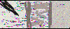
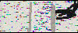
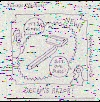

# img
My project for the AlgoExpert software engineering competition winter 2020 

<h3>Overview</h3>

The inspiration for this project is simple, cut down image(and eventually video) storage space. If I could build such an algorithm, companies 
would be able to drastically cut down their storage space. This is done by changing the image into a text file. Since text files are easier 
to compress and transmit, a business would simply store the text on a server. On the front end, this text is then converted to an image. 
This will cut down the storage space required for any business. By saving the text of a grayscaled image (instead of fully colored one), a company
(like AlgoExpert) will be able to really cut down storage space. The project is able to create the essence of the image but isn't able to capture the the subtelty of the relative shading between pixels. However, it is able to create a reasonable image, especially given the constraints   

    All in all, this project was really hard to do. Figuring out what I wanted took a lot of time. I spent almost all my free time(when I had the ability) working on the project and trying to take different approaches to solve this problem. I've rewritten almost the whole project from scratch multiple times to try multiple apporaches. However, I'm glad I did it. This project has taught me a lot, and I plan on seeing it through to completion. I'm glad that I could build a working proof of concept that
  Youtube Vid: https://www.youtube.com/watch?v=6MP4v6LYO5g

<h3>Who Am I?</h3>

      
Here's my information: https://people.rit.edu/dl1683/#projects<bt>
Looking for summer co-ops. Pls hire me.
 

<h3>What this project does</h3>

This project converts a picture into text . While converting an image into text, it changes the image 
into grayscale. Grayscaled texts require lesser space and easier to compress than colored ones since the grayscaling algorithm changes 
[r,g,b]-->[val] where 0<=r,g,b<=255 and 0<=val<=1. Doing so changes a 3-dimensional space (r,g,b) into a single dimensional space. Therein lies
the problem; there's infinite (literally) solns to any given configuration (in this case infinite ways to get any  grayscaled value from [r,g,b]). To reconvert a grayscale image into color (black and white to color) is impossible (from a mathematical standpoint). By using machine learning of some sort however, one can hope to create reasonable approximations of an image.  
 

<h3>Theoretical Challenges</h3>

To understand the chanllenges of this problem one needs to understand basic linear algebra. As is often taught, to solve for n variables, one
needs n <b>linearly independent and consistent</b> equations. By grayscaling, we remove the dimensions. By constraining values we can 
remove the element of infinite solns, but we still have to make assumptions on 2 of the 3 vars (r,g,b) to get the 3rd. 
 
While thinking of ways to work around this problem, I came up with visualizing the r,g,b as a 3-D plane. By each value by 255, we get the
vector[1,1,1] for white and [0,0,0] for black. Everyother color would have some other vector: v= [x,y,z], [x,y,z]->[0,1]. Every grayscaled
value would be the distance (length) of the vector projection of v onto the vector [1,1,1]. The treating of distance as a distance opened
up some interesting possibilities such as pathfinding (probably A*), random forest (maybe Markov Chains) and nearest neighbours regression. 
These solutions unfortunately could not be implemented for practical reasons discussed below.  

<h3>Practical challenges</h3>

There were some practical challenges to overcome. The biggest were:
<ul>
<b>College and work</b>: I had to work on this project while handling school, and my 4 part-time jobs 
(researcher, tutor, and campus rep for 2 companies). There was the issue of 18 credit hours of classes and exams. Fortunately I've been 
able to maintain my grades and work while building my solution.   
</ul>
<ul>
<b>Co-ops for the summer</b>: As a 19 year old sohpmore, I'm supposed to get a summer co-op. As an international 
student, I've had to put a lot of effort into finding a co-op that I am eligible for. Looking for the coops and applying has been very 
time consuming. 
</ul>
<ul>
<b>Training models and lack of resources </b>: Training and testing the various models is very resource intensive. I tried to use some of 
online resources but it was really hard configuring them to work. Running everything on my laptop would total it. I decided to use my department
severs. Unfortunately they restrict the resources we can use (40Mb). I needed the some space to work on my assignments, so I couldn't implement some of
my ideas (GANS, CNNS, Hill Climbing, RandomForest, pathfinding, and Association learning). I also couldn't test on the servers. Thus I decided to serialize
my models while testing(on the server), and actually test my solutions on my PC.
</ul>
<ul>
  <b>Central Limit Threorem</b> Because of the the nature of deriving pixels from neighbors the individual rgb values would each tend towards a certain value. This meant that directly using the predict function with the neighbors would return a less grayed (still gray value).  
</ul>

<h3>Important Code Bits</h3>

  Following are the important (and not obvious parts of my code). They are really important to my code. 
<ul>
<b><Gamma Param randomizer</b>: Imgs.py (117-120). This piece of code is responsible for most of the output in terms of color. The randomized Gamma param is used to ungray the grayed r,g,b vals. Unfortunalately, randomness also adds a lot of noise. By using constrained optimization we can minimize this problem(done implicitly to calculate the randomness range, alongside trial and error). However, to get rid the noise, I would have to implement Gaussian Denoising and edge detection. To do so, requires computing, which I hope to gain by presenting this soln. as a proof of concept to our great and groundbreaking faculty.       
</ul>

<ul>
<b>Handling a 2D array and 1 D array in 1 loop</b>: Imgs.py (190 and 203-205). I had to read a 1D array (list of all grayscale vals saved in the most efficient text form possible) and  also a 2D array (the image itself). Furthermore, I needed to calculate the 
  corresponding  1d locations of the 2D image neighbors. All of this required some mental and algebriac gymnastics but I figured it 
  out in the end. To not have to loop over the text (list) and then [i,j] 2-D Arr, I went back to counting and treated the len(l) as a number of base (width of picture). Then I could treat i,j accordingly and I needed only 1 for loop for the entire process (complexity O(n^2) instead of O(2n^2) with a lot more  memory used or O(n^4) with the same amount of memory as my current soln.) This part was really easy to implement when I figured out what to do and the formulae.         
</ul>

<ul>
<b>All of Train.py</b>: Nothing else would be possible without the ability to serialize the models. It let me train over the server and save my laptop.         
</ul>

<h3>File overview</h3>

I have a lot of files. This is what they do: 
<ul>
<b>ImgEnhance.py</b>: This is the main file to run. Run this to see the solution in action. (Takes a while)    
</ul>
<ul>
<b>Train.py</b>: Training file. This is what I've used to train on my uni servers. If I can negociate for more space and resources I will be adding
and removing from this. Also serializes my models to reduce my computation. The training works by using a list of grayscales of the neighbors
as the input to produce the output. 
</ul>
<ul>
<b>Img.py</b>: This is the file that actually deals with everything to do with images. It converts to text and vice-versa.
</ul>
<ul>
<b>test.py</b>: My testing file. This was built so that I could test specific ideas and modules without running the whole thing. Really saved 
me a lot of time and computation. 
</ul>

<ul>
<b>txt.py</b>: This file the mapping, encoding, and decoding of the various files.  The grayscaling etc. is handled by this file.  
</ul>

<ul>
<b>new_net.py</b>: My variation on a neural net. I was going to write one to optimize my training for my specific problem. Unfortunately, 
because of the aforementioned space issues, I had to rely on sklearn. I will continue to build this on my own.  
</ul>

<h3>Progress and next steps</h3>

I've gotten to a pretty good place in terms of the solutions. The generated image retains all the information and distinguishable edges
and the form of the original image. It also maintains the relative shading of the image. However, it can't fully work out the 
recoloring. I will continue to test different things to get that. 
 Below are some of the next steps:
<ul>
<b>Training the neighbors with r,g,b seperately</b>: The easiest possible soln. I came up with. However, I haven't implemented this because
prediction one pixel with one model is very intensively. Using 3 per pixel will be too much (both training and testing). I will
see if I can get the resources to get this working. 
</ul>

<ul>
<b>GANS</b>: I'm expecting GANs to be really good for something like this. Training them will be a handful, but they should be exciting. 
The problem will be making them into a practical soln. 
</ul>
<ul>
<b>CNNS</b>: Another fun idea. Also very intensive. Don't think they will be as good GANS. 
</ul>
<ul>
<b>Random Forests</b>: Something I will try out first. The nature of this problem seems like it will lend itself 
to random forest. 
</ul>
<ul>
<b>Gray->color fitting</b>: Something I'm thinking of trying as a way to weigh the solutions. By fitting the grayscale to color, we will
run the risk of overfitting. However, it has potential to work wonders to generate a new image
</ul>

<h3>Images comparison</h3>
I have 3 different images that I tested with. Each has distinct features to test the ability of the recreation function. Smol 3 in particular is a very complex image with changes in shading, and a hard shapes. The image is recreated pretty faithfully and we can conclude that by applying some generative functions and gamma corrections, we will get a faithful approximation of the original image.  
. The colored dots in the recreated images are places where the shading of the image changes by a certain amount. I will work on minimizing error there.  
<b>Originals</b> 
Image 1:

 
 Image 2:

Image 3:

 
<b>GrayScaled</b> 

Image 1

                    
Image 2

Image 3

 

<b>Recolored (from black and white)</b> 
Image 1

Image 2

Image 3

 

<h3>Recommended Things/Bibliograhy</h3>

Following were some of the areas I looked for inspiration. I looked a lot to hilbert curves and various mathematical foundation for
mapping and creation.
<ul>
https://ieeexplore.ieee.org/document/6460162
</ul>
<ul>
http://citeseerx.ist.psu.edu/viewdoc/download?doi=10.1.1.323.8826&rep=rep1&type=pdf
</ul>
<ul>
https://people.csail.mit.edu/jaffer/Geometry/HSFC
</ul>
<ul>
https://math.stackexchange.com/questions/921985/what-is-the-hilbert-curves-equation
</ul>
<ul>
http://www.cs.cmu.edu/~christos/PUBLICATIONS/ieee-tkde-hilbert.pdf
</ul>
<ul>
https://arxiv.org/pdf/1710.06384.pdf
</ul>
<ul>
https://bioconductor.org/packages/devel/bioc/vignettes/HilbertCurve/inst/doc/HilbertCurve.html
</ul>
<ul>
https://www.scs.stanford.edu/11au-cs240h/projects/sinis.pdf
</ul>
<ul>
https://developers.google.com/web/fundamentals/performance/optimizing-content-efficiency/image-optimization
</ul>
<ul>
https://scikit-learn.org/stable/modules/svm.html#mathematical-formulation
</ul>
<ul>
https://towardsdatascience.com/demystifying-deep-image-prior-7076e777e5ba
</ul>
<ul>
https://ieeexplore.ieee.org/document/4408909
</ul>

